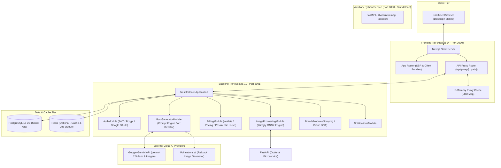
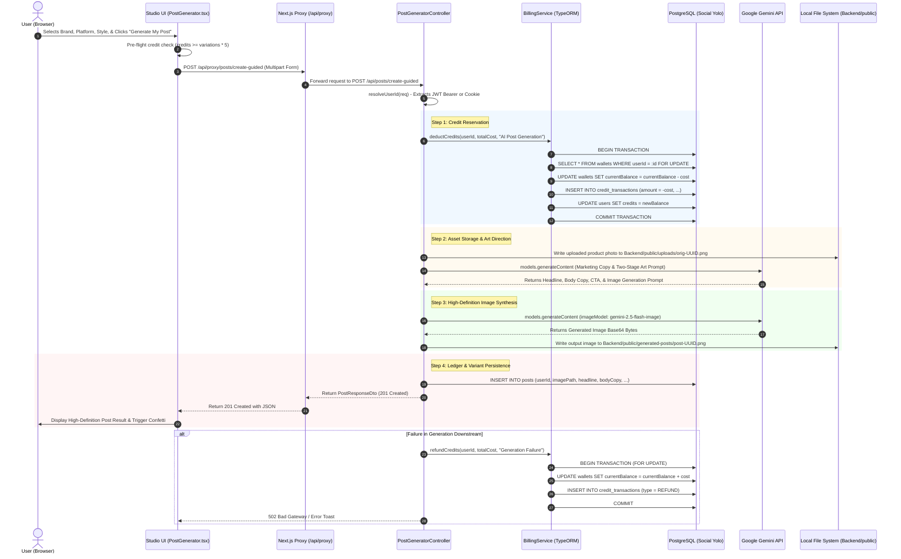

# Social Yolo AI — System Architecture Audit

**Author:** Senior Software Architect & AI Systems Engineer  
**Date:** September 29, 2026  
**Status:** Complete Read-Only Architectural Review  
**Target Repositories:** `social-yolo-frontend`, `Social_Yolo_BE/Backend`, `Social_Yolo_BE/image-service`

---

## 1. System Topology & Component Overview

The Social Yolo AI platform is structured as a decoupled multi-tier architecture consisting of three primary runtimes, a relational database, and an optional in-memory data store:

---

## 2. End-to-End User Workflow & Data Tracing

### Workflow: Prompt Submission to Generation, Storage, and Settlement

---

## 3. Inter-Service Communication & Failure Modes

### 1. Frontend-to-Backend Relay (`/api/proxy/[...path]`)
- **Protocol:** HTTP/1.1 REST over local reverse proxy.
- **Implementation:** [`social-yolo-frontend/src/app/api/proxy/[...path]/route.ts`](file:///c:/Users/HH%20T/Desktop/Social-yolo/social-yolo-frontend/src/app/api/proxy/%5B...path%5D/route.ts).
- **Design Intent:** Eliminate CORS restrictions and prevent exposing internal backend port numbers (3001) to browser clients.
- **Architectural Defects Identified:**
  - **In-Memory Caching Race Condition:** The proxy implements a custom in-memory LRU cache (`proxyCache`) with a 15-second TTL. The cache key generator relies on `x-user-id` header (`req.headers.get('x-user-id') || 'anon'`). Because the browser client rarely sets `x-user-id` explicitly (relying on `Authorization: Bearer <token>`), multiple authenticated users share the identical cache key: `anon:auth:<path>`.
  - **Single Failure Impact:** A server restart or crash of the Next.js process evicts all in-flight streaming operations.

### 2. NestJS Background Removal Queue (`BackgroundRemovalQueueService`)
- **Protocol:** Dual-mode Hybrid: Redis List/PubSub if Redis is reachable; In-Memory EventEmitter & bounded queue if Redis is offline.
- **Implementation:** [`Social_Yolo_BE/Backend/src/image-processing/background-removal-queue.service.ts`](file:///c:/Users/HH%20T/Desktop/Social-yolo/Social_Yolo_BE/Backend/src/image-processing/background-removal-queue.service.ts).
- **Concurrency Control:** Hardcoded `maxConcurrency = 2`.
- **Architectural Safeguards:**
  - File size cutoff at 2.5MB: If an uploaded image exceeds 2.5MB, in-process ONNX inference is bypassed (`passthrough-large-asset`) to prevent Node.js V8 heap out-of-memory crashes.
  - 15-second execution timeout using `Promise.race()` to prevent thread starvation.
- **Failure Mode:** If both native ONNX and Redis fail, the service gracefully falls back to returning the original image buffer without crashing the HTTP pipeline.

### 3. Gemini AI Provider Integration (`GeminiService`)
- **SDK:** Official `@google/genai` v2.21.0.
- **Implementation:** [`Social_Yolo_BE/Backend/src/post-generator/gemini.service.ts`](file:///c:/Users/HH%20T/Desktop/Social-yolo/Social_Yolo_BE/Backend/src/post-generator/gemini.service.ts).
- **Models Configured:**
  - Text & Planning: `gemini-2.5-flash`
  - Image Synthesis: `models/gemini-2.5-flash-image` (fallback to Pollinations.ai if Gemini fails or is unconfigured)
  - Embedding: `gemini-embedding-001`
- **Failure Mode:** If Gemini API rate limits (429) or throws 503, the service catches the error, logs a warning, and falls back to deterministic rule-based marketing copy templates and Pollinations.ai image generation.

---

## 4. Single Points of Failure (SPOF) & Resilience Analysis

| Component | Redundancy | SPOF Risk | Impact of Failure | Recommended Mitigation |
| :--- | :---: | :---: | :--- | :--- |
| **PostgreSQL Database** | None (Single node) | **HIGH** | Complete platform downtime; auth, billing, and post creation fail immediately. | Implement managed PostgreSQL with multi-AZ failover and automated point-in-time recovery (PITR). |
| **Local Disk Storage (`Backend/public`)** | None | **CRITICAL** | Asset loss upon container restart, pod reschedule, or deployment. | Replace local disk writes with Amazon S3 / Cloudflare R2 / Google Cloud Storage with CDN signed URLs. |
| **NestJS Backend Node Process** | Single instance | **MEDIUM** | Event loop lockup during heavy image decoding freezes API for all users. | Cluster backend using PM2 or Kubernetes multi-replica deployments behind an ALB / NGINX reverse proxy. |
| **Gemini API Quota** | Single API Key | **MEDIUM** | HTTP 429 quota exhaustion blocks AI generation platform-wide. | Implement quota monitoring, exponential backoff with jitter, and multi-key / multi-provider fallback pools. |
| **In-Memory Cache (Proxy & Node)** | Memory-bound | **LOW** | Cache invalidation leaks or cache loss upon restart. | Migrate all distributed cache keys to Redis with strict tenant namespaces. |

---

## 5. Architectural Recommendations

1. **Decouple Asset Storage from Application Container:** Refactor `PostGeneratorService` and `PostsService` to upload generated images and user assets directly to an S3-compatible bucket rather than writing to `process.cwd() + '/public'`.
2. **Eliminate Next.js In-Memory API Proxy Caching:** Remove `proxyCache` from `route.ts`. Let HTTP cache headers (`Cache-Control: private, no-store`) govern client caching, and delegate API caching strictly to Redis on the backend.
3. **Migrate Vector Retrieval to pgvector:** Replace in-memory cosine similarity computation over `this.embeddingRepo.find()` with native PostgreSQL `pgvector` indexing (`HNSW` / `IVFFlat`).
