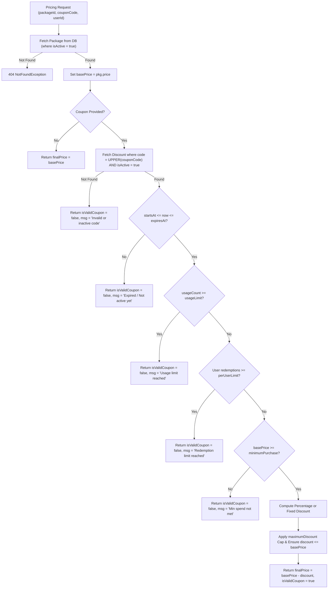

# Social Yolo AI — Credit, Pricing, Wallet, Transaction & Billing System Audit

**Author:** Senior Software Architect & Security Auditor  
**Date:** September 29, 2026  
**Status:** Complete Code & Data Verification  
**Single Source of Truth:** PostgreSQL 18 Database (`Social Yolo`)

---

## 1. Credit Wallet Architecture & Concurrency Control

Every user account is backed by a database row in the `wallets` table ([`Wallet`](file:///c:/Users/HH%20T/Desktop/Social-yolo/Social_Yolo_BE/Backend/src/billing/entities/wallet.entity.ts)):
- `id` (UUID Primary Key)
- `userId` (UUID Unique Foreign Key -> `users.id`)
- `currentBalance` (Integer)
- `totalPurchased` (Integer)
- `totalUsed` (Integer)
- `totalRefunded` (Integer)
- `createdAt`, `updatedAt` (Timestamps)

### Concurrency & Pessimistic Row-Level Locking Verification
In [`BillingService.deductCredits`](file:///c:/Users/HH%20T/Desktop/Social-yolo/Social_Yolo_BE/Backend/src/billing/billing.service.ts#L256-L316), credit deduction is wrapped inside a managed database transaction:
```typescript
return await this.dataSource.transaction(async (manager) => {
  const walletRepo = manager.getRepository(Wallet);
  let wallet = await walletRepo.findOne({
    where: { userId },
    lock: { mode: 'pessimistic_write' }, // Translates to: SELECT ... FOR UPDATE
  });

  if (wallet.currentBalance < amount) {
    throw new BadRequestException(`Insufficient credits. Required: ${amount}, Available: ${wallet.currentBalance}.`);
  }

  const balanceBefore = wallet.currentBalance;
  const balanceAfter = balanceBefore - amount;

  wallet.currentBalance = balanceAfter;
  wallet.totalUsed = (wallet.totalUsed || 0) + amount;
  await walletRepo.save(wallet);

  // Sync user.credits for backwards compatibility
  const userRepo = manager.getRepository(User);
  await userRepo.update(userId, { credits: balanceAfter });

  // Record immutable transaction
  const txRepo = manager.getRepository(CreditTransaction);
  const tx = txRepo.create({
    userId,
    walletId: wallet.id,
    type: options?.type || TransactionType.AI_GENERATION_USAGE,
    amount: -amount,
    balanceBefore,
    balanceAfter,
    referenceId: options?.referenceId || null,
    description: reason,
    metadata: options?.metadata || null,
    createdBy: options?.createdBy || 'system',
  });
  return { transactionId: (await txRepo.save(tx)).id, balanceAfter };
});
```

### Concurrency Assessment:
- **Pessimistic Locking:** Verified. `mode: 'pessimistic_write'` issues a SQL `SELECT ... FOR UPDATE` row lock in PostgreSQL.
- **Race Condition Resistance:** Verified. Concurrent requests attempting to deduct from the same user balance are serialized by PostgreSQL until the active transaction commits.
- **Negative Balance Protection:** Verified. `wallet.currentBalance < amount` check executes under the row lock.

---

## 2. Immutable Ledger & Transaction Types

Every balance change writes an immutable row to `credit_transactions` ([`CreditTransaction`](file:///c:/Users/HH%20T/Desktop/Social-yolo/Social_Yolo_BE/Backend/src/billing/entities/credit-transaction.entity.ts)).

| Transaction Type | Triggering Action | Amount Sign | User Balance Impact | Audit Log Created? |
| :--- | :--- | :---: | :---: | :---: |
| `BONUS` | Initial User Registration (50 Credits) | Positive (`+50`) | Increments balance | No (System Event) |
| `PURCHASE` | Order Checkout / Payment Confirmation | Positive (`+credits`)| Increments balance | No (Financial Order) |
| `AI_GENERATION_USAGE`| AI Studio Post Generation | Negative (`-cost`) | Decrements balance | No (Ledger only) |
| `REFUND` | Downstream Gemini API Generation Failure | Positive (`+cost`) | Increments balance | No (Notification sent)|
| `ADMIN_CREDIT` | Admin Manual Top-Up (`/admin/billing`) | Positive (`+amount`) | Increments balance | **Yes (`AdminAuditLog`)** |
| `ADMIN_DEBIT` | Admin Manual Deduction (`/admin/billing`) | Negative (`-amount`) | Decrements balance | **Yes (`AdminAuditLog`)** |
| `DISCOUNT` | Promo Code Credit Grant | Positive (`+amount`) | Increments balance | No (Coupon record) |

---

## 3. Centralized Pricing & Promo Code Engine

[`PricingService.calculatePackagePrice`](file:///c:/Users/HH%20T/Desktop/Social-yolo/Social_Yolo_BE/Backend/src/billing/pricing.service.ts) serves as the backend single source of truth for pricing:



### Verified Engine Strengths:
1. **Zero Client Trust:** Discount calculations are executed purely on the backend. The frontend cannot pass an arbitrary `finalPrice`.
2. **Cap Enforcement:** Discounts can never reduce price below `$0.00`.
3. **Per-User Limits:** `CouponUsage` records ensure users cannot redeem one-time coupons multiple times across sessions.

---

## 4. Critical Billing & Security Vulnerabilities

### Finding 1: Unauthenticated Post Generation Bypasses Credit Deductions (P0)
- **Affected File:** [`PostGeneratorController.ts`](file:///c:/Users/HH%20T/Desktop/Social-yolo/Social_Yolo_BE/Backend/src/post-generator/post-generator.controller.ts#L135) and [`PostGeneratorService.ts`](file:///c:/Users/HH%20T/Desktop/Social-yolo/Social_Yolo_BE/Backend/src/post-generator/post-generator.service.ts#L141).
- **Vulnerability:**
  `createGuided` uses `resolveUserId(req)`. If no token is provided, `userId` is `null`.
  In `PostGeneratorService`:
  ```typescript
  // 1. Credit deduction for registered users with atomic reservation
  if (userId) {
    await this.billingService.deductCredits(userId, totalCreditsCost, ...);
  }
  ```
  If `userId === null`, the deduction is skipped entirely!
- **Impact:** An attacker can generate infinite high-definition posts without spending any credits or paying for any packages.

### Finding 2: Unverified Payment Webhook Signature (P0)
- **Affected File:** [`BillingController.ts`](file:///c:/Users/HH%20T/Desktop/Social-yolo/Social_Yolo_BE/Backend/src/billing/billing.controller.ts#L113-L131).
- **Vulnerability:**
  ```typescript
  @Post('webhook')
  async paymentWebhook(@Body() dto: WebhookDto, @Headers('x-webhook-signature') signature?: string) {
    if (!dto.orderId) return { received: true, ignored: true };
    return this.billingService.confirmPayment(dto.orderId, dto.paymentReference, ...);
  }
  ```
  The endpoint accepts arbitrary `orderId` and does NOT verify HMAC SHA-256 signatures against a shared secret.
- **Impact:** Any attacker can forge a POST request to `/billing/webhook` with an unfulfilled order ID to grant themselves thousands of credits for free.

### Finding 3: Unmetered Standalone Background Removal (P1)
- **Affected File:** [`ImageProcessingController.ts`](file:///c:/Users/HH%20T/Desktop/Social-yolo/Social_Yolo_BE/Backend/src/image-processing/image-processing.controller.ts#L45-L133).
- **Vulnerability:**
  The database seeds `BACKGROUND_REMOVAL` = 3 credits in `credit_costs`.
  However, `ImageProcessingController.removeBackground` never calls `billingService.deductCredits`.
- **Impact:** Users can remove backgrounds for free on `/dashboard/bg-remover` without spending the required 3 credits.
