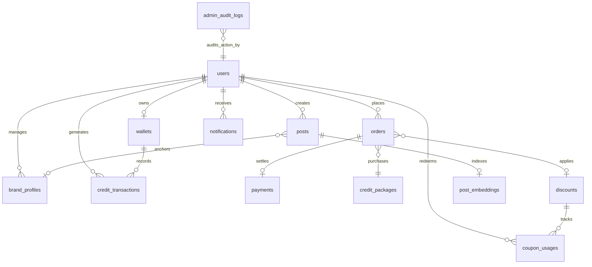
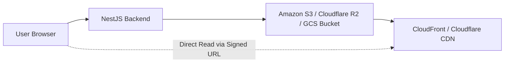

# Social Yolo AI — Database Schema, Persistence & Storage Infrastructure Audit

**Author:** Senior Software Architect & Database Engineer  
**Date:** September 29, 2026  
**Status:** Complete Read-Only Inspection  
**Database Engine:** PostgreSQL 18 on port 5432  
**ORM Framework:** TypeORM v0.3.31 via `@nestjs/typeorm` v12.0.1

---

## 1. Relational Entity Schema & Foreign Key Map

The database architecture consists of 14 relational tables:



### Table Specifications:

| Entity Name | Primary Key | Critical Columns | Unique / Indexed Columns | Foreign Keys & Cascades |
| :--- | :---: | :--- | :--- | :--- |
| `users` | `id` (UUID) | `email`, `password_hash`, `role`, `credits`, `plan`, `is_active` | `idx_users_email` (UNIQUE), `idx_users_google_id`, `idx_users_role` | None (Root Entity) |
| `wallets` | `id` (UUID) | `currentBalance`, `totalPurchased`, `totalUsed`, `totalRefunded` | `userId` (UNIQUE) | `userId` -> `users.id` (`ON DELETE CASCADE`) |
| `credit_transactions`| `id` (UUID) | `amount`, `balanceBefore`, `balanceAfter`, `type`, `referenceId` | `idx_ctx_user`, `idx_ctx_wallet`, `idx_ctx_type` | `walletId` -> `wallets.id`, `userId` -> `users.id` |
| `credit_costs` | `id` (UUID) | `featureKey`, `creditCost`, `description`, `isActive` | `featureKey` (UNIQUE) | None (Master Dynamic Configuration) |
| `credit_packages`| `id` (UUID) | `name`, `credits`, `price`, `currency`, `discountPercentage` | None | None (Commercial Master Data) |
| `discounts` | `id` (UUID) | `code`, `type`, `value`, `minimumPurchase`, `maximumDiscount` | `code` (UNIQUE) | None |
| `coupon_usages`| `id` (UUID) | `discountId`, `userId`, `orderId`, `discountAmount` | None | `discountId` -> `discounts.id`, `userId` -> `users.id` |
| `orders` | `id` (UUID) | `orderNumber`, `basePrice`, `discountAmount`, `finalPrice`, `status` | `orderNumber` (UNIQUE), `idempotencyKey` (UNIQUE) | `userId` -> `users.id`, `packageId` -> `credit_packages.id` |
| `payments` | `id` (UUID) | `orderId`, `amount`, `currency`, `provider`, `status`, `reference` | `reference` (UNIQUE) | `orderId` -> `orders.id` |
| `admin_audit_logs` | `id` (UUID) | `adminId`, `action`, `targetType`, `targetId`, `reason` | `idx_audit_admin`, `idx_audit_action` | `adminId` -> `users.id` |
| `posts` | `id` (UUID) | `userPrompt`, `headline`, `bodyCopy`, `cta`, `imagePath`, `isFavorite` | None | `userId` -> `users.id`, `brandProfileId` -> `brand_profiles.id` |
| `post_embeddings` | `id` (UUID) | `postId`, `userPrompt`, `contentText`, `embedding` (`real[]`) | `postId` (UNIQUE) | `postId` -> `posts.id` (`ON DELETE CASCADE`) |
| `brand_profiles` | `id` (UUID) | `brandName`, `websiteUrl`, `primaryColor`, `tone`, `isDefault` | None | `userId` -> `users.id` (`ON DELETE CASCADE`) |
| `notifications` | `id` (UUID) | `userId`, `title`, `message`, `type`, `isRead` | None | `userId` -> `users.id` (`ON DELETE CASCADE`) |

---

## 2. Critical Migration & Schema Drift Risk (P0)

### Code Evidence:
In [`Social_Yolo_BE/Backend/src/config/database.config.ts#L47-L50`](file:///c:/Users/HH%20T/Desktop/Social-yolo/Social_Yolo_BE/Backend/src/config/database.config.ts):
```typescript
export const databaseConfig: TypeOrmModuleOptions = {
  // ...
  // Only auto-synchronize schema during development to prevent data loss in production
  synchronize: process.env.NODE_ENV !== 'production',
  logging: ['error', 'warn'],
};
```

### The Production Defect:
- During local development, TypeORM's `synchronize: true` automatically detects changes to `@Entity()` classes and runs `CREATE TABLE` and `ALTER TABLE` statements against PostgreSQL.
- However, in production (`NODE_ENV=production`), `synchronize` is disabled (`false`) as an industry standard safeguard against destructive schema drops.
- **The Defect:** There are **ZERO migration files** in the codebase.
- **Failure Scenario:** When this application is deployed to a production environment with a clean PostgreSQL instance and `NODE_ENV=production`, the application boots, connects to the empty database, and crashes or throws SQL errors on every endpoint because none of the tables exist!
- **Mitigation Requirement:** Generate an initial baseline migration using TypeORM CLI (`migration:generate`) and automate running `migration:run` during container initialization.

---

## 3. Storage Architecture: Local Disk vs Cloud Object Storage

### Current Implementation:
- Generated campaign posts: Written to `resolve(process.cwd(), 'public', 'generated-posts')`.
- User uploaded assets: Written to `resolve(process.cwd(), 'public', 'uploads')`.
- Serving mechanism: `NestExpressApplication.useStaticAssets` on `/api/`.

### Critical Production Failure Scenarios:
1. **Container Ephemerality (Docker / Kubernetes / Cloud Run / ECS):**
   - Cloud containers are ephemeral. Whenever a pod scales down, crashes, or is redeployed with a new release, the container's writable layer is wiped out.
   - **All historical generated posts and user product photos will be permanently deleted.**
2. **Multi-Replica Inconsistency:**
   - If the backend is scaled horizontally to 2 or more replicas behind a load balancer, an image generated on Replica A will return `404 Not Found` when a user's browser requests it from Replica B.
3. **Storage Depletion:**
   - Without an automated lifecycle policy (e.g. archiving older assets or storing on object storage), local disk space will steadily fill up, eventually crashing the operating system.

### Recommended Cloud Storage Architecture:


---

## 4. In-Memory RAG Vector Storage & Scaling Limitations

In [`RetrieverService.retrieveStyleContext`](file:///c:/Users/HH%20T/Desktop/Social-yolo/Social_Yolo_BE/Backend/src/post-generator/rag/retriever.service.ts#L55):
```typescript
const rows = await this.embeddingRepo.find({ relations: { post: true } });
const scored = rows
  .filter((row) => row.embedding && row.embedding.length > 0)
  .map((row) => ({
    row,
    similarity: cosineSimilarity(queryEmbedding, row.embedding),
  }));
```

### Analysis:
- Table `post_embeddings` stores embeddings as a PostgreSQL `real[]` array.
- For 50 posts, loading the entire table into Node.js heap memory takes ~5ms.
- However, at 10,000 posts across all users:
  1. `embeddingRepo.find()` loads 10,000 records (each containing a 768-float array) + post relations.
  2. Memory footprint: ~30MB+ per request.
  3. Node.js single-threaded event loop spends 150–300ms computing cosine similarity in pure JavaScript, causing latency spikes for all concurrent HTTP requests.
- **Recommended Fix:** Install PostgreSQL `pgvector` extension, define column as `vector(768)`, and query nearest neighbors using native SQL:
  ```sql
  SELECT post_id, 1 - (embedding <=> $1) AS similarity 
  FROM post_embeddings 
  WHERE user_id = $2 
  ORDER BY embedding <=> $1 LIMIT 5;
  ```
