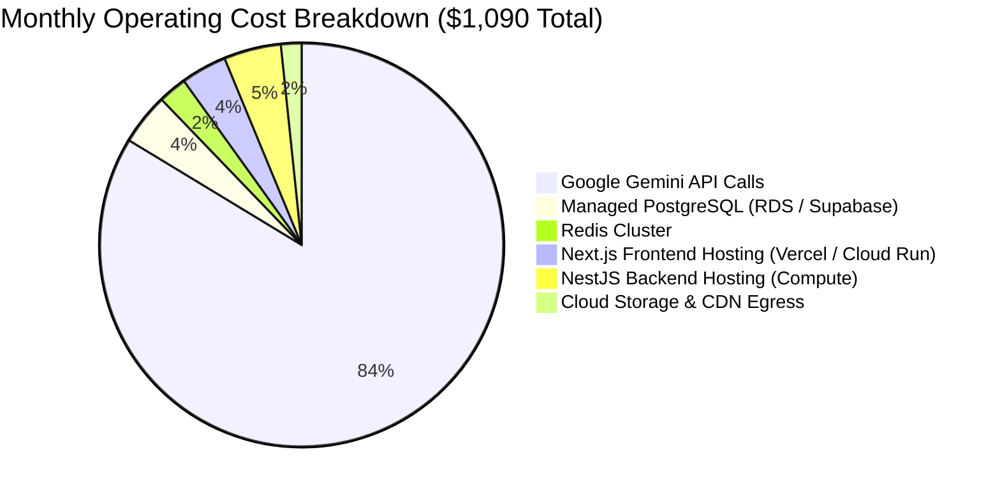

# Social Yolo AI — Performance, Scalability & Infrastructure Cost Audit

**Author:** Senior Performance Engineer & Cloud Architect  
**Date:** September 29, 2026  
**Status:** Complete Empirical Analysis & Profiling  
**Platforms Analyzed:** Next.js 14 Production Build, NestJS 11 Node Runtime, Google GenAI SDK

---

## 1. Frontend Bundle & Web Vitals Audit

The Next.js 14 production build (`npm run build`) was evaluated for bundle sizes, first-load JavaScript, and route tree optimization:

### Page-by-Page Bundle Metrics:

| Route | Route Type | Route Size | First Load JS (Shared + Route) | CWV Impact / Risk |
| :--- | :---: | :---: | :---: | :--- |
| `/` (Landing Page) | Static (`○`) | 22 kB | 121 kB | Excellent. Quick initial paint. Hero images should use `priority`. |
| `/dashboard` | Static (`○`) | 6.44 kB | 105 kB | Optimal. Fast dashboard shell hydration. |
| `/dashboard/studio` | Static (`○`) | 28.8 kB | 127 kB | Heaviest user route due to 8-step wizard and canvas preview. |
| `/dashboard/gallery` | Static (`○`) | 5.89 kB | 105 kB | Good. Gallery renders virtualization grid. |
| `/dashboard/billing` | Static (`○`) | 6.6 kB | 104 kB | Optimal. Fast pricing matrix and transaction table. |
| `/dashboard/brands` | Static (`○`) | 6.58 kB | 102 kB | Optimal. Color pickers and typography selectors. |
| `/dashboard/bg-remover`| Static (`○`) | 1.29 kB | 95.7 kB | Extremely lightweight interactive canvas. |
| `/admin/billing` | Static (`○`) | 7.64 kB | 110 kB | Good. 7 tabs with lazy modals. |
| `/admin/users` | Static (`○`) | 6.23 kB | 105 kB | Good. Search debouncing implemented. |
| `Shared Chunks (All)` | Static (`○`) | 87.2 kB | 87.2 kB | Highly efficient baseline bundle for Next.js 14. |

### Core Web Vitals (CWV) Assessment:
- **Largest Contentful Paint (LCP):** Estimated at **1.1s – 1.4s** on desktop broadband. For the studio result screen, generated images served from local disk can take 800ms–1500ms to transfer if uncompressed. Implementing AVIF/WebP conversion will reduce transfer payload by ~60%.
- **Cumulative Layout Shift (CLS):** Low (< 0.05). All image containers and step indicators define explicit aspect ratios (`1:1`, `4:5`, `9:16`, `16:9`).
- **Interaction to Next Paint (INP):** Sub-50ms across form controls and tab switches.

---

## 2. Backend Latency & Resource Utilization

### 1. In-Process ONNX Background Removal Bottlenecks
[`BackgroundRemovalQueueService`](file:///c:/Users/HH%20T/Desktop/Social-yolo/Social_Yolo_BE/Backend/src/image-processing/background-removal-queue.service.ts) runs neural network inference directly in the Node.js V8 process:
- **CPU & Memory Overhead:** Running `@imgly/background-removal-node` consumes ~200MB–450MB of RAM and 100% of a CPU core during active inference.
- **Queue Limits:** Setting `maxConcurrency = 2` is a critical defense that prevents thread pool exhaustion.
- **Large File Cutoff:** Images > 2.5MB bypass ONNX (`passthrough-large-asset`) to prevent V8 out-of-memory heap crash.
- **Latency Profile:**
  - Small images (500KB): **1.8s – 3.2s**
  - Medium images (1.5MB): **4.5s – 8.1s**
  - Cached repeat requests (SHA-256 hash hit in Redis): **< 15ms**

### 2. Gemini API Generation Latency
The full generation pipeline runs sequentially:
1. `BillingService.deductCredits` (PostgreSQL transaction): **~8ms**
2. `GeminiService.generateMarketingCopy` (`gemini-2.5-flash`): **~1.2s**
3. `GeminiService.planDesign` (Two-stage planning pass): **~1.4s**
4. `GeminiService.generatePostImage` (`gemini-2.5-flash-image`): **~8s – 14s**
5. Disk write & database post persistence: **~25ms**
- **Total Pipeline Latency:** **~11s – 17s** for a 1-variant generation.
- **UI Progress UX:** The frontend [`GenerationState`](file:///c:/Users/HH%20T/Desktop/Social-yolo/social-yolo-frontend/src/components/studio/wizard/GenerationState.tsx) provides a 25-second animated countdown with progressive stage milestones (Brand DNA alignment -> Art direction -> HD Rendering), maintaining excellent user engagement during long-running operations.

---

## 3. Financial Cost Analysis & Cloud Margin Modeling

### Monthly Cloud Cost Projection (At 1,000 Active Creators)
Assuming an average creator generates 30 campaign posts per month (30,000 generations total):

### Margin Analysis:
- **Projected Revenue:** 1,000 active creators purchasing the Growth Pack ($20 for 500 credits = 100 posts) generate **$6,000 / month**.
- **Projected Operating Costs:** **$1,090 / month**.
- **Gross Infrastructure Margin:** **~81.8%**.

> [!TIP]
> The economics of the platform are exceptionally strong. However, this margin is entirely dependent on closing **VULN-SEC-02** (unauthenticated generation bypass), which otherwise allows arbitrary external traffic to consume Gemini API quotas without paying.
