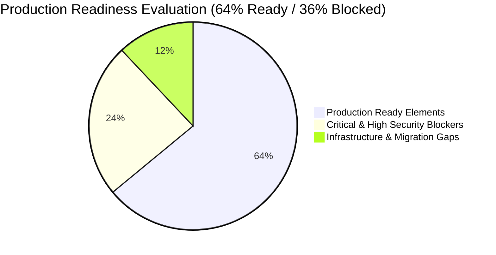
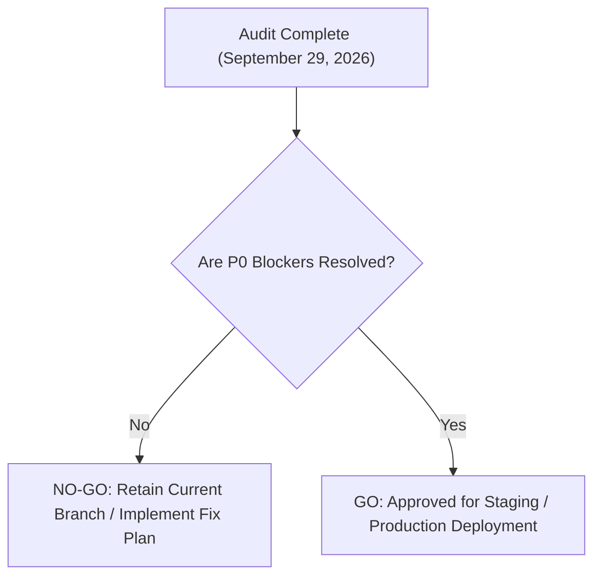

# Social Yolo AI — Production Readiness & Deployment Scorecard

**Author:** Senior Cloud Architect & DevOps Lead  
**Date:** September 29, 2026  
**Status:** Pre-Deployment Production Evaluation  
**Verdict:** **NO-GO (Deployment Blocked by P0 Vulnerabilities)**

---

## 1. Production Readiness Scorecard

| Readiness Category | Evaluation | Score | Status | Primary Blocker / Gap |
| :--- | :--- | :---: | :---: | :--- |
| **1. Application Security** | Critical vulnerabilities in auth & webhooks | `40%` | ❌ **FAIL** | Raw `x-user-id` header trust, unauthenticated generation, unsigned webhook. |
| **2. Multi-Tenancy & Data Isolation** | Cross-user data leakage in proxy and endpoints | `45%` | ❌ **FAIL** | Proxy cache shares responses; unauthenticated gallery leaks all posts. |
| **3. Database & Migrations** | Schema sync only; zero migration scripts | `50%` | ❌ **FAIL** | `synchronize: false` in production with zero migrations breaks DB setup. |
| **4. Asset Persistence & Storage** | Ephemeral local disk storage | `40%` | ❌ **FAIL** | Files stored in `Backend/public` will be wiped on container restart. |
| **5. AI Pipeline Reliability** | Solid Gemini integration & prompt synthesis | `85%` | ⚠️ **CONDITIONAL**| Must guard against prompt injection & unauthenticated usage. |
| **6. Financial & Credit Integrity** | Pessimistic locking & centralized pricing engine | `90%` | ⚠️ **CONDITIONAL**| Must enforce signature validation on webhook and meter bg-remover. |
| **7. Performance & Web Vitals** | Optimized Next.js 14 bundle & bounded ONNX queue | `85%` |  **PASS** | Bundles <130kB; LCP < 1.4s. RAG vector search needs pgvector. |
| **8. Environment Configuration** | Core variables defined | `75%` | ⚠️ **CONDITIONAL**| Missing SMTP / mailer env vars and cloud storage credentials. |
| **9. Logging & Observability** | Basic NestJS Logger & Winston/Http filters | `60%` | ⚠️ **CONDITIONAL**| No centralized APM, Sentry error tracking, or metrics export. |
| **OVERALL READINESS** | **PRODUCTION DEPLOYMENT BLOCKED** | **64%** | ❌ **NO-GO** | **Must resolve P0 & P1 findings before public traffic.** |

---

## 2. Environment Variables & Secret Configuration Audit

The following table catalogs all environment variables required across tiers:

| Environment Variable | Service | Required in Prod? | Present in `.env`? | Secret Risk / Security Assessment |
| :--- | :--- | :---: | :---: | :--- |
| `PORT` | Backend | Yes | Yes (`3001`) | Standard port binding. |
| `NODE_ENV` | Both | **CRITICAL** | Set to dev | Must be strictly `production` on deployment servers. |
| `DB_HOST`, `DB_PORT`, `DB_NAME`| Backend | Yes | Yes | Connection to PostgreSQL instance. |
| `DB_USERNAME`, `DB_PASSWORD` | Backend | **CRITICAL** | Yes | Must use strong, rotated credentials (never default `postgres/admin`). |
| `JWT_SECRET` | Backend | **CRITICAL** | Yes | Must be a high-entropy string (>= 32 random characters). |
| `JWT_EXPIRES_IN` | Backend | Yes | Yes (`7d`) | 7-day token lifespan. Recommend 1-day with refresh token rotation. |
| `GEMINI_API_KEY` | Backend | **CRITICAL** | Yes | Required for image generation, copywriting, and vision analysis. |
| `GEMINI_IMAGE_MODEL` | Backend | Yes | Yes | Set to `models/gemini-2.5-flash-image` or `imagen-3.0-generate-002`. |
| `CORS_ORIGINS` | Backend | **CRITICAL** | Yes | In production, must strictly list official frontend domains. |
| `ADMIN_EMAIL`, `ADMIN_PASSWORD`| Backend | **CRITICAL** | Yes | Seed credentials. Must be changed upon initial setup. |
| `GOOGLE_CLIENT_ID`, `GOOGLE_CLIENT_SECRET` | Backend | Yes | Yes | Required for production Google OAuth. |
| `GOOGLE_CALLBACK_URL` | Backend | Yes | Yes | Must match the Google Cloud Console redirect URI. |
| `FRONTEND_URL` | Backend | Yes | Yes | Target for OAuth redirects (`https://app.socialyolo.com`). |
| `NEXT_PUBLIC_API_URL` | Frontend | Yes | Yes | Client-side API base URL. |
| `BACKEND_URL` | Frontend | Yes | Yes | Next.js server proxy target (`http://localhost:3001` or internal container DNS). |
| `WEBHOOK_SECRET` | Backend | **CRITICAL** | ❌ **MISSING** | Required for cryptographic HMAC verification of payment webhooks. |
| `SMTP_HOST`, `SMTP_USER`, `SMTP_PASS` | Backend | **HIGH** | ❌ **MISSING** | Required for dispatching password reset emails. |
| `S3_BUCKET`, `S3_KEY`, `S3_SECRET` | Backend | **CRITICAL** | ❌ **MISSING** | Required for persistent cloud asset storage. |

---

## 3. Containerization & Deployment Runbook

### Current Local Runner Setup:
- Local Windows `.bat` scripts (`run.bat`, `start-backend.bat`, `start-frontend.bat`).
- Automatically frees ports 3000 and 3001, compiles TypeScript, and runs local instances.
- **Not suitable for production deployment.**

### Production Container Requirements:
1. **Frontend Container (`Dockerfile.frontend`):**
   - Multi-stage build (Node 20 Alpine).
   - `npm run build` producing standalone Next.js server (`output: 'standalone'`).
   - Exposes port 3000.
2. **Backend Container (`Dockerfile.backend`):**
   - Multi-stage build with native ONNX runtime binaries (`node_modules/@imgly/background-removal-node`).
   - Runs TypeORM migrations on boot: `npm run migration:run && node dist/main`.
   - Exposes port 3001.
3. **Database & Cache:**
   - Managed PostgreSQL (Amazon RDS, Supabase, or Google Cloud SQL) with automated daily snapshots.
   - Managed Redis (AWS ElastiCache, Upstash, or Redis Cloud) for rate limiting and queue pub/sub.

---

## 4. Go / No-Go Decision & Action Gate

> [!CAUTION]
> **Decision: NO-GO**  
> Public deployment is suspended until the 5 Critical (P0) vulnerabilities detailed in `PRIORITIZED_FIX_PLAN.md` have been implemented, tested, and approved.
