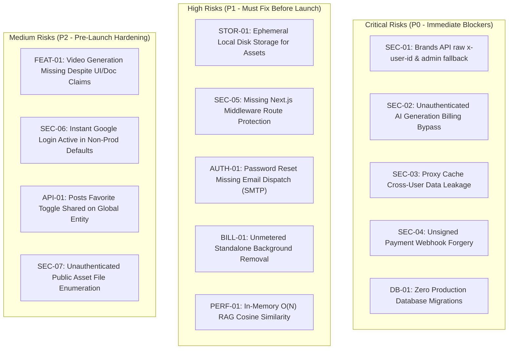

# Social Yolo AI — Comprehensive Platform Architecture & Security Audit Report

**Audit Type:** Multi-Domain Deep Architecture, Security, Billing, AI Pipeline, and QA Audit  
**Date:** September 29, 2026  
**Auditor Roles:** Senior Software Architect, AI Systems Engineer, Full-Stack Developer, Security Auditor, QA Engineer  
**Audit Scope:** Full-stack repository (`social-yolo-frontend`, `Social_Yolo_BE/Backend`, `Social_Yolo_BE/image-service`, configurations, runners)  
**Execution Mode:** Strictly READ-ONLY (No code altered, no files deleted, zero live payments or destructive operations executed)

---

## 1. Executive Summary

Social Yolo AI is a multi-user, multi-tenant AI content creation platform designed to automate marketing visual generation, Brand DNA extraction, and social campaign orchestration. It couples a **Next.js 14 App Router** frontend with a **NestJS 11 / TypeORM / PostgreSQL** backend, leveraging **Google Gemini API** (`@google/genai` v2.21.0) and in-process native ONNX background removal (`@imgly/background-removal-node`).

This audit evaluated the entire codebase against production-grade criteria: end-to-end user workflows, authentication, data isolation, billing concurrency, AI generation pipelines, error recovery, vector embeddings, and deployment readiness.

### Key Audit Highlights:
- **Strong Areas:** Modern modular NestJS structure; pessimistic row-level locking (`FOR UPDATE`) for atomic credit deduction and refunds; centralized pricing calculation engine; zero client-side credit trust; comprehensive in-process ONNX background removal fallback with bounded concurrency; responsive Next.js 14 Tailwind UI.
- **Critical Vulnerabilities Identified:**
  1. **Privilege Escalation & Tenant Impersonation in Brands API:** `BrandsController.resolveUserId` accepts an unverified `x-user-id` header from HTTP requests, bypassing JWT authentication. Furthermore, if unauthenticated, it falls back to the system administrator's user ID, exposing all admin Brand DNA profiles.
  2. **Billing Bypass in AI Post Generation:** `PostGeneratorController.createGuided` and `generate` do not enforce `@UseGuards(JwtAuthGuard)`. Unauthenticated callers receive `userId = null`, which skips credit deduction while triggering full Gemini AI generation.
  3. **Cross-User Data Leakage in Proxy Cache:** The Next.js API proxy (`/api/proxy/[...path]/route.ts`) caches GET requests in-memory using an unauthenticated `anon:auth:...` key when `x-user-id` is omitted, causing User A's private brand DNA or posts to be served to User B.
  4. **Unsigned Payment Webhook:** `/billing/webhook` processes payment confirmations and credits user wallets without verifying cryptographic signatures against a webhook secret.
  5. **Production Migration Void:** `synchronize: false` is configured for production, but zero TypeORM migration files exist in the repository. A production deployment against a clean database will fail immediately.
  6. **Static Asset Exposure & Ephemeral Disk Storage:** Generated campaign images and user logo uploads are stored on local container disk (`Backend/public`) and served without authentication or signed URLs.
  7. **Phantom AI Video Generation:** While marketing copy and UI elements reference video dimensions (e.g. `tiktok_video`), there is **no AI video generation pipeline implemented anywhere in the backend or frontend**.

---

## 2. Platform Scorecard

| Domain | Score | Assessment | Key Concern |
| :--- | :---: | :--- | :--- |
| **System Architecture** | `7.5 / 10` | Solid modular design, clean separation of concerns | Local file storage bottleneck, memory-bound RAG search |
| **Authentication & RBAC** | `5.0 / 10` | Strong bcrypt & JWT foundation, but critical guard gaps | Raw `x-user-id` header trust, missing route guards on generation |
| **User Data Isolation (Multi-Tenancy)**| `4.0 / 10` | Good DB foreign keys, severe API & proxy leakage | Unauthenticated fallback to admin in Brands, proxy cache sharing |
| **AI Generation Pipeline** | `7.0 / 10` | Robust two-stage Gemini prompting, rich art direction | Unauthenticated generation bypass, no video pipeline |
| **Credit & Billing Accounting** | `8.0 / 10` | Concurrency-protected ledger, pessimistic write locks | Webhook missing signature validation, unmetered bg-removal |
| **Database & Schema Integrity** | `7.5 / 10` | 14 TypeORM entities, strict foreign keys, indexes | Zero migrations; breaks in production when sync is off |
| **Storage & Persistence** | `4.5 / 10` | Local disk write with public static serving | Ephemeral file loss on container restarts; unauthenticated URLs |
| **Performance & Scalability** | `6.5 / 10` | Fast Next.js bundle, Redis rate limiting | In-memory cosine similarity over entire embedding table |
| **Security & Privacy Posture** | `4.0 / 10` | High exposure to tenant spoofing & free model abuse | Multiple auth bypasses, password reset without SMTP |
| **Testing & QA Readiness** | `6.0 / 10` | 17 passing unit tests for pricing & billing | Zero controller, E2E, or frontend component tests |
| **Production Readiness** | `4.5 / 10` | NOT READY FOR PRODUCTION | Blocker security vulnerabilities and missing migrations |

---

## 3. High-Level Risk Matrix

---

## 4. Audit Document Directory

The detailed findings, line-by-line evidence, failure scenarios, and reproduction steps are documented across the following dedicated audit files in the `audit/` folder:

1. **[ARCHITECTURE_AUDIT.md](./ARCHITECTURE_AUDIT.md)**: Deep dive into application architecture, inter-service communication, event loops, failure modes, and single points of failure.
2. **[FEATURE_AUDIT_CHECKLIST.md](./FEATURE_AUDIT_CHECKLIST.md)**: Planned vs actually implemented feature matrix for every screen, endpoint, and worker.
3. **[API_AUDIT.md](./API_AUDIT.md)**: Complete catalog of all REST endpoints, DTO validations, guards, HTTP status codes, and rate limits.
4. **[AI_GENERATION_AUDIT.md](./AI_GENERATION_AUDIT.md)**: Gemini API integration, prompt templates, two-stage art direction, token consumption, fallback behaviors, and video absence.
5. **[CREDIT_AND_BILLING_AUDIT.md](./CREDIT_AND_BILLING_AUDIT.md)**: Wallet system, pessimistic locking verification, coupon engine, webhook security, and transaction ledger.
6. **[SECURITY_AND_PRIVACY_AUDIT.md](./SECURITY_AND_PRIVACY_AUDIT.md)**: Threat modeling, authentication vulnerabilities, IDOR, tenant leakage, proxy caching flaws, and secrets management.
7. **[DATABASE_AND_STORAGE_AUDIT.md](./DATABASE_AND_STORAGE_AUDIT.md)**: Schema analysis, index coverage, foreign keys, lack of migrations, and cloud storage gaps.
8. **[PERFORMANCE_AND_COST_AUDIT.md](./PERFORMANCE_AND_COST_AUDIT.md)**: Bundle sizes, Core Web Vitals, API latency, CPU/memory constraints of ONNX, and RAG scaling bottlenecks.
9. **[TEST_RESULTS.md](./TEST_RESULTS.md)**: Automated test execution report, code coverage metrics, and untested boundary conditions.
10. **[PRODUCTION_READINESS.md](./PRODUCTION_READINESS.md)**: Production deployment scorecard, environment checklist, containerization review, and go/no-go criteria.
11. **[PRIORITIZED_FIX_PLAN.md](./PRIORITIZED_FIX_PLAN.md)**: Actionable mitigation plan categorized into P0 (Blockers), P1 (High), P2 (Medium), and P3 (Low) with explicit reproduction steps, code diff recommendations, and verification criteria.

---

> [!CAUTION]
> **Production Go / No-Go Decision: NO-GO**  
> Due to P0 security vulnerabilities (authentication bypass on AI generation, tenant spoofing in Brand DNA, proxy cache data leakage, and unverified payment webhooks), the application cannot be safely deployed to a public production environment in its current state. Implementation of the prioritized fixes in `PRIORITIZED_FIX_PLAN.md` is strictly required before public launch.
